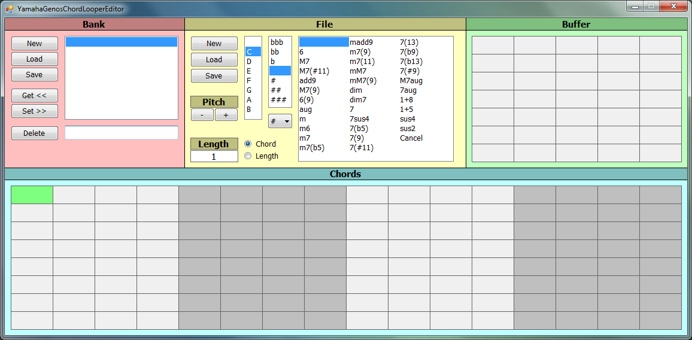

# Yamaha-Genos-Chord-Looper-Editor

### Beschreibung:
Ein Programm zum einfachen Erstellen und Editieren von Chord-Looper Daten und Bänken für den Yamaha Genos. Getestet mit Firmware v2.11.

### Bild:

### Funktionen:
- Akkorde werden Quantisiert.
- Transponierungs-Funktion.
- Begrenzung auf 128 Beats.
- BassNote wird mit ChordRoot gleichgesetzt.
- Typ 3 Akkorde werden nicht unterstützt.

### Bedienung:
- Bank: Im roten bereich können Bänke (CLB) verwaltet werden.
  - Bänke können erstellt, geladen und gespeichert werden.
  - Mit [Get <<] werden die Daten des selektierten Eintrags in das Akkord-Gitter geladen.
  - Mit [Set >>] werden die Daten des Akkord-Gitters in einen Bankeintrag geschrieben.
  - Mit [Delete] wird ein Bankeintrag gelöscht.

- File: Im gelben Bereich können Chord-Looper-Daten (CLD) verwaltet werden.
  - Chord-Looper-Daten können erstellt, geladen und gespeichert werden.
  - Akkorde können transponiert werden.

- Buffer: Im grünen Bereich werden bereits verwendete Akkorde zwischengespeichert.
  - Mit der linken Maustaste wird ein Akkord gewählt.
  - Mit der rechten Maustaste wird ein Akkord gelöscht.

- Chords: Im türkisen Bereich wird die Akkord-Sequenz festgelegt.
  - Mit der linken Maustaste werden Akkorde geschrieben.
  - Mit der rechten Maustaste werden Akkorde gelöscht.
  - Mit der mittleren Maustaste wird die Länge der Sequenz festgelegt.

- Mit [Escape] kann das Programm beendet werden.
